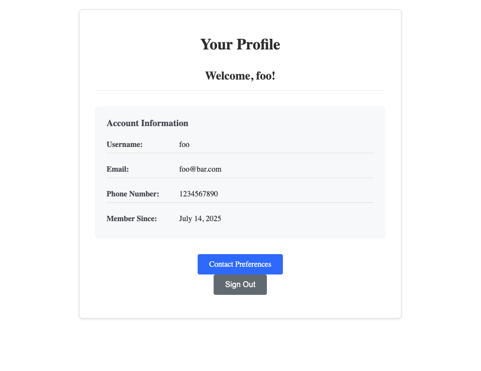

# 🚂 Modular Rails

A scalable Rails application built with a **modular engine architecture** that demonstrates clean separation of concerns, dependency injection, and event-driven communication between business domains.

> 🤖 **Note**: All code in this project was 100% AI generated, showcasing the capabilities of modern AI-assisted development.

> 📖 **Inspired by**: [The Modular Monolith: Rails Architecture](https://medium.com/@dan_manges/the-modular-monolith-rails-architecture-fb1023826fc4)

## 📚 Table of Contents

- [🚂 Modular Rails](#-modular-rails)
  - [📚 Table of Contents](#-table-of-contents)
  - [🏗️ Architecture Overview](#️-architecture-overview)
    - [🎯 Engine Responsibilities](#-engine-responsibilities)
  - [🔗 Inter-Engine Communication](#-inter-engine-communication)
    - [Event-Driven Architecture](#event-driven-architecture)
    - [📋 User Signup Flow](#-user-signup-flow)
    - [Clean API Boundaries](#clean-api-boundaries)
  - [🔧 Creating New Engines](#-creating-new-engines)
    - [Engine Structure](#engine-structure)
  - [📋 Development Guidelines](#-development-guidelines)
    - [Code Quality Patterns](#code-quality-patterns)
  - [🧪 Testing Strategy](#-testing-strategy)
    - [Test Coverage Areas](#test-coverage-areas)
  - [🛠️ Getting Started](#️-getting-started)
    - [Prerequisites](#prerequisites)
    - [Development Setup](#development-setup)
    - [Development Commands](#development-commands)
    - [Usage Flow](#usage-flow)
  - [📁 Project Structure](#-project-structure)
  - [🎯 Architectural Benefits](#-architectural-benefits)
    - [✅ **Scalability**](#-scalability)
    - [✅ **Maintainability**](#-maintainability)
    - [✅ **Testability**](#-testability)
    - [✅ **Developer Experience**](#-developer-experience)

## 🏗️ Architecture Overview

This application showcases a **multi-engine Rails architecture** where each business domain is encapsulated in its own engine, enabling independent development and testing.

```
┌─────────────────────────────────────────────────────────────────────────────┐
│                              RAILS APPLICATION                              │
│                                                                             │
│  ┌────────────────────────────────────────────────────────────────────┐     │
│  │                           UI ENGINE                                │     │
│  │                      (Presentation Layer)                          │     │
│  │                   Controllers • Views • Forms                      │     │
│  └───────────────┬─────────────────┬───────────────────────┬──────────┘     │
│                  │                 │                       │          |     │
│                  ▼                 ▼                       |          |     │
│  ┌─────────────────────────────────────────┐               |          |     │
│  │         NOTIFICATIONS ENGINE            │               |          |     │
│  │       (Email & Preferences)             │               |          |     │
│  │   Contact Prefs • Email Services        │◀-┐            |          |     │
│  │   Event Subscribers • Notifications     │  |            |          |     │
│  └────────────┬─────────────┬──────────────┘  |events      |          |     │
│               │             │                 |            |          |     │
│               ▼             ▼                 |            ▼          |     │
│  ┌─────────────────────────────────────────────────────────────────┐  |     │
│  │                    USERS ENGINE                                 │  |     │
│  │                 (Domain Logic)                                  │  |     │
│  │        User Models • Authentication • User Services             │  |     │
│  └────────────────────────┬────────────────────────────────────────┘  |     │
│                           │                                           |     │
│                           │                                           |     │
│                           │                                           |     │
│                           │                                           │     │
│                           ▼                                           ▼     │
│  ┌─────────────────────────────────────────────────────────────────────┐    │
│  │                         CORE ENGINE                                 │    │
│  │                     (Foundation Layer)                              │    │
│  │    ApplicationController • ApplicationRecord • Shared Utilities     │    │
│  └─────────────────────────────────────────────────────────────────────┘    │
│                                                                             │
└─────────────────────────────────────────────────────────────────────────────┘

Dependencies:
  ─────▶  Direct dependency (imports/uses)
  ┌───┐  Event emission (loose coupling)
  └───┘
```

### 🎯 Engine Responsibilities

| Engine                                      | Purpose                                                                              | Key Components                                                                                                                                                                                                                                        |
| ------------------------------------------- | ------------------------------------------------------------------------------------ | ----------------------------------------------------------------------------------------------------------------------------------------------------------------------------------------------------------------------------------------------------- |
| **[Core](engines/core/)**                   | Foundation layer providing base classes and shared functionality                     | [`ApplicationController`](engines/core/app/controllers/application_controller.rb), [`ApplicationRecord`](engines/core/app/models/application_record.rb)                                                                                               |
| **[Users](engines/users/)**                 | User domain logic, authentication, and **profile data** (email, phone) management    | [`User`](engines/users/app/models/user.rb), [`UserSignupInfo`](engines/users/app/models/user_signup_info.rb), [`UsersApi`](engines/users/app/services/users_api.rb), [`UserCreationService`](engines/users/app/services/user_creation_service.rb)     |
| **[Notifications](engines/notifications/)** | **Notification preferences** (email/phone enabled flags), email services, and events | [`UserContactPreference`](engines/notifications/app/models/user_contact_preference.rb), [`NotificationsApi`](engines/notifications/app/services/notifications_api.rb), [`MockEmailService`](engines/notifications/app/services/mock_email_service.rb) |
| **[UI](engines/ui/)**                       | User interface controllers, views, and forms                                         | [`UsersController`](engines/ui/app/controllers/users_controller.rb), [`ContactPreferencesController`](engines/ui/app/controllers/contact_preferences_controller.rb)                                                                                   |

## 🔗 Inter-Engine Communication

### Event-Driven Architecture
```
┌─────────────────────────────────────────────────────────────────┐
│                    NOTIFICATIONS ENGINE                         │
│                                                                 │
│  ┌─────────────────────────────────────────────────────────┐    │
│  │            UserCreatedEventSubscriber                   │    │
│  │                                                         │    │
│  │  • Listens for users.user_created events                │    │
│  │  • Auto-creates contact preferences                     │    │
│  │  • Sends welcome emails                                 │    │
│  └─────────────────────────────────────────────────────────┘    │
│                              ▲                                  │
│                              │                                  │
│                              │ users.user_created               │
│                              │ event                            │
└─────────┬────────────────────┼──────────────────────────────────┘
          |                    │
          ▼                    │
┌──────────────────────────────┼──────────────────────────────────┐
│                    USERS ENGINE                                 │
│                              │                                  │
│  ┌───────────────────────────┼─────────────────────────────┐    │
│  │          UserCreationService                            │    │
│  │                           │                             │    │
│  │  • Creates user account   │                             │    │
│  │  • Creates signup info    │                             │    │
│  │  • Emits creation event   |                             │    │
│  │                           │                             │    │
│  └───────────────────────────┼─────────────────────────────┘    │
│                              │                                  │
│                              │                                  │
└──────────────────────────────┼──────────────────────────────────┘
                               │
                               ▼
                        ActiveSupport::Notifications
                           (Rails Event Bus)
```

Events are managed through Rails' `ActiveSupport::Notifications` with [event subscriptions](engines/notifications/config/initializers/event_subscriptions.rb) configured in initializers.

### 📋 User Signup Flow

Here's what happens when a user signs up, demonstrating the complete inter-engine communication:

1. **Form Submission** - User fills out the signup form and submits it to the [`UsersController#create`](engines/ui/app/controllers/users_controller.rb) action in the UI engine

2. **API Call** - The controller calls [`UsersApi#create_user`](engines/users/app/services/users_api.rb) in the Users engine, passing the form parameters

3. **User Creation** - The API delegates to [`UserCreationService#call`](engines/users/app/services/user_creation_service.rb) which:
   - Creates the [`User`](engines/users/app/models/user.rb) record with username and password
   - Creates the associated [`UserSignupInfo`](engines/users/app/models/user_signup_info.rb) record with email and phone
   - Wraps both operations in a database transaction for consistency

4. **Event Emission** - Upon successful user creation, the service emits a `users.user_created` event through Rails' `ActiveSupport::Notifications` system

5. **Event Handling** - The [`UserCreatedEventSubscriber`](engines/notifications/app/services/user_created_event_subscriber.rb) in the Notifications engine automatically:
   - Listens for the `users.user_created` event
   - Creates initial [`UserContactPreference`](engines/notifications/app/models/user_contact_preference.rb) with default notification settings (email and phone notifications enabled)
   - Fetches the user's email from the Users engine via [`UsersApi`](engines/users/app/services/users_api.rb)
   - Sends a welcome email via [`MockEmailService`](engines/notifications/app/services/mock_email_service.rb)

6. **Response** - The [`UsersApi`](engines/users/app/services/users_api.rb) returns a structured response to the controller with success status and any errors

7. **User Feedback** - The [`UsersController`](engines/ui/app/controllers/users_controller.rb) redirects to a success page with a flash message, or renders the form again with validation errors

This flow demonstrates the clean separation of concerns: the UI engine handles presentation, the Users engine manages user data, and the Notifications engine handles communication preferences. The automatic creation of contact preferences and welcome email is triggered through events, ensuring the Users engine doesn't need to know about notification concerns.

### Clean API Boundaries
Each engine exposes clean APIs with structured responses. The **Users engine is the single source of truth** for profile data (email, phone number), while the Notifications engine only manages notification preferences:

```ruby
# Users Engine API - owns profile data
result = UsersApi.new.create_user(
  username: 'john',
  password: 'secret',
  email: 'john@example.com',
  phone_number: '+1234567890'
)
# => { success: true, user: <User>, errors: [] }

# Users Engine API - update profile data
result = UsersApi.new.update_user_profile(
  user_id: user.id,
  email: 'newemail@example.com',
  phone_number: '+9876543210'
)
# => { success: true, user: <User>, errors: [] }

# Notifications Engine API - only manages notification preferences
result = NotificationsApi.new.create_contact_preference(user_id: user.id)
# => { success: true, contact_preference: <UserContactPreference>, errors: [] }

# Notifications Engine API - update notification settings only
result = NotificationsApi.new.update_contact_preference(
  user_id: user.id,
  email_notifications_enabled: true,
  phone_notifications_enabled: false
)
# => { success: true, contact_preference: <UserContactPreference>, errors: [] }
```

## 🔧 Creating New Engines

To create a new engine, use the provided template:

```bash
bundle exec rails app:template LOCATION=lib/templates/engine.rb
```

This will generate a new engine structure in `engines/`

### Engine Structure
```
engines/your_engine/
├── app/
│   ├── controllers/
│   ├── models/
│   ├── services/           # Business logic layer
│   └── views/
├── config/
│   └── initializers/       # Engine-specific configuration
├── lib/
│   └── your_engine/
│       └── engine.rb       # Engine definition
└── spec/                   # Comprehensive test suite
    ├── controllers/
    ├── models/
    ├── services/
    └── views/
```

## 📋 Development Guidelines

This project follows established [coding standards](/.github/copilot-instructions.md) that emphasize:

- **Dependency Injection** - All services use constructor injection for testability
- **Named Arguments** - Methods use named parameters for clarity
- **Structured Returns** - APIs return consistent hash structures
- **No Cross-Engine Dependencies** - Engines communicate only through defined APIs
- **Event-Driven Design** - Cross-cutting concerns handled via events
- **Comprehensive Testing** - Tests covering all layers

### Code Quality Patterns
```ruby
# ✅ GOOD: Service with dependency injection
class UserCreationService
  def initialize(active_record_base: ActiveRecord::Base, user_model: User)
    @active_record_base = active_record_base
    @user_model = user_model
  end

  def call(username:, password:, email:, phone_number: nil)
    # Implementation with structured return
    { success: true, user: user, errors: [] }
  end
end

# ✅ GOOD: Clean API boundary
class UsersApi
  def create_user(username:, password:, email:, phone_number: nil)
    service = UserCreationService.new
    service.call(username: username, password: password, email: email, phone_number: phone_number)
  end
end
```

## 🧪 Testing Strategy

The application maintains comprehensive test coverage across all layers:

```bash
# Run all tests
bundle exec rspec --format progress

# Run tests for specific engine
bundle exec rspec engines/users/spec/ --format documentation
bundle exec rspec engines/notifications/spec/ --format documentation
bundle exec rspec engines/ui/spec/ --format documentation

# Run specific test types
bundle exec rspec engines/ui/spec/system/ --format documentation  # System tests
bundle exec rspec engines/users/spec/services/ --format documentation  # Service tests
```

### Test Coverage Areas
- **Unit Tests** - Models, services, and individual components
- **Integration Tests** - Full request/response cycles
- **System Tests** - End-to-end user flows with browser simulation
- **View Tests** - Template rendering and form parameter structure
- **API Tests** - Service boundaries and error handling

## 🛠️ Getting Started

### Prerequisites
- Ruby 3.4+ (see `.ruby-version` for exact version)
- Rails 8.0+
- Docker and Docker Compose
- Node.js (for asset compilation)

### Development Setup

1. **Clone the repository**
   ```bash
   git clone <repository-url>
   cd modular-rails
   ```

2. **Install Ruby version**
   ```bash
   # Using rbenv
   rbenv install $(cat .ruby-version)
   rbenv local $(cat .ruby-version)

   # Using rvm
   rvm install $(cat .ruby-version)
   rvm use $(cat .ruby-version)
   ```

3. **Install dependencies**
   ```bash
   bundle install
   ```

4. **Set up environment variables**
   ```bash
   # Copy the example environment file
   cp example.env .env

   # Edit .env with your specific configuration
   # Most defaults should work for development
   ```

5. **Start database services**
   ```bash
   # Start PostgreSQL and Redis in Docker
   docker compose up -d
   ```

6. **Setup database**
   ```bash
   bundle exec rails db:create db:migrate

   # Optional: Add seed data
   bundle exec rails db:seed
   ```

7. **Start the Rails server**
   ```bash
   bundle exec rails server
   # Or use the convenience script:
   bin/dev
   ```

8. **Visit the application**
   - Open http://localhost:3000 in your browser
   - You should see the user signup page
   - Create a new user account by filling out the signup form
   - After successful signup, you'll be taken to your profile page:

   

   *The profile page showing the user interface with navigation and user information*

### Development Commands

```bash
# Run all tests
bundle exec rspec --format progress

# Run tests for specific engine
bundle exec rspec engines/users/spec/ --format documentation
bundle exec rspec engines/notifications/spec/ --format documentation
bundle exec rspec engines/ui/spec/ --format documentation

# Run specific test types
bundle exec rspec engines/ui/spec/system/ --format documentation  # System tests
bundle exec rspec engines/users/spec/services/ --format documentation  # Service tests

# Stop Docker services when done
docker compose down
```

### Usage Flow
1. **Sign Up** - Create a new user account at `/`
2. **Automatic Setup** - Notification preferences created automatically via events
3. **Profile Management** - View profile at `/users/profile` with flash messages
4. **Contact Preferences** - Edit contact info (email, phone) and notification settings at `/contact_preferences`
5. **Email Simulation** - Check logs for mock email activity

## 📁 Project Structure

```
├── engines/                    # Modular engines
│   ├── core/                  # Foundation engine
│   ├── users/                 # User management engine
│   ├── notifications/         # Notifications engine
│   └── ui/                    # User interface engine
├── lib/
│   └── templates/
│       └── engine.rb          # Engine generator template
├── config/                    # Main app configuration
├── spec/                      # Main app tests
└── .github/
    └── copilot-instructions.md # Coding standards
```

## 🎯 Architectural Benefits

### ✅ **Scalability**
- Engines can be developed independently
- Clear separation enables team specialization
- Easy to add new business domains

### ✅ **Maintainability**
- Isolated concerns reduce complexity
- Dependency injection enables easy testing
- Event-driven design prevents tight coupling
- Single source of truth for data (no duplication across engines)

### ✅ **Testability**
- Comprehensive test coverage
- Mocked dependencies for unit testing
- Integration and system tests for full flows

### ✅ **Developer Experience**
- Clear engine responsibilities
- Consistent coding patterns
- Professional UI and error handling

---

**Built with ❤️ using modular Rails architecture principles**
